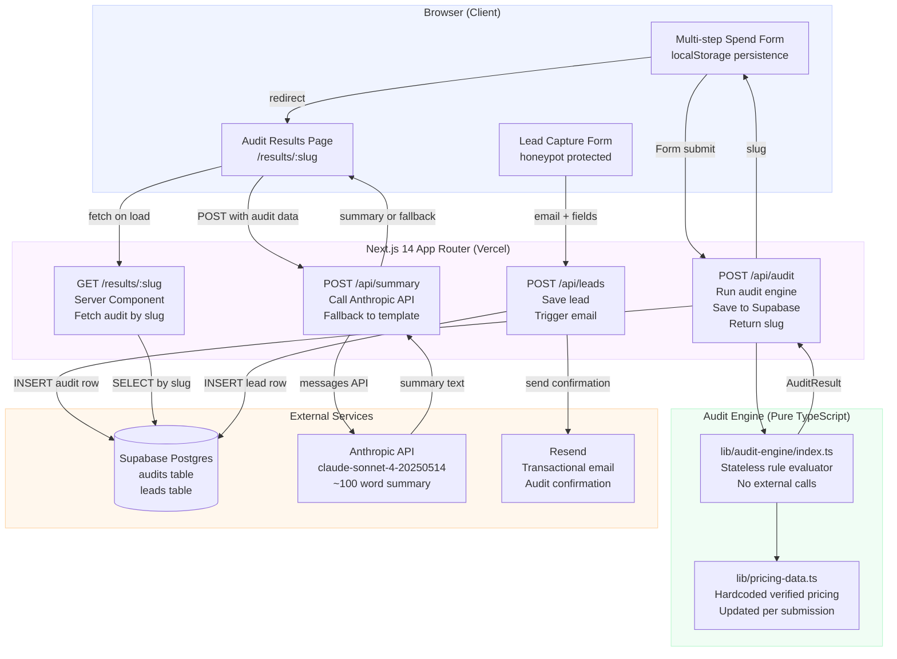

# ARCHITECTURE.md — System Design
## AI Spend Audit Tool · Next.js + Supabase + Anthropic API

---

## System Diagram



---

## Data Flow — Form Input to Audit Result

### Step 1 — Form (Client, localStorage)
The user fills in tools, plans, seats, and spend across the multi-step form.
State is serialised to `localStorage` under the key `credex_audit_draft` on every
change. If the user closes the tab and returns, the form rehydrates from storage.
No server call is made until the user explicitly submits.

### Step 2 — POST /api/audit (Next.js Route Handler)
On submit, the client POSTs the raw form payload to `/api/audit`.
The route handler does four things in sequence:

```
1. Validate input shape (Zod schema)
2. Pass validated data into runAudit() — pure function, no I/O
3. Generate a URL-safe slug (nanoid, 10 chars)
4. INSERT one row into supabase.audits with:
   { slug, tool_data (jsonb), results (jsonb), team_size, use_case, created_at }
5. Return { slug, results } to client
```

The audit engine (`lib/audit-engine/index.ts`) is a pure TypeScript function —
no database calls, no API calls, no side effects. Input in, result out. This makes
it fully testable in isolation and the reason the 5 required Jest tests are fast.

### Step 3 — Redirect to /results/[slug]
The client receives the slug and navigates to `/results/[slug]`.
This is a Next.js Server Component — it fetches the audit row server-side before
sending HTML. The public version strips `email` and `company_name` from the
rendered output (they remain in the DB for Credex's use).

### Step 4 — POST /api/summary (parallel, non-blocking)
The results page fires a client-side POST to `/api/summary` with the audit results.
This is intentionally async and non-blocking — the page renders immediately with a
loading skeleton, and the AI summary fills in when ready (typically 1.5–3s).
If the Anthropic API returns a non-2xx or times out after 8s, the route handler
returns a pre-built template summary instead. The user never sees an error state.

The API key is read server-side only (`process.env.ANTHROPIC_API_KEY`).
It is never exposed to the browser. The client calls `/api/summary`, not Anthropic.

### Step 5 — POST /api/leads (on email capture)
When the user submits the lead form, the client POSTs to `/api/leads`.
The route handler:
```
1. Checks honeypot field (if filled → silently discard, return 200)
2. Checks rate limit (Upstash Redis token bucket, 3 req/IP/hour)
3. INSERT into supabase.leads { email, company, role, audit_id, savings_amount }
4. POST to Resend API → send confirmation email to user
5. If savings_amount > 500 → flag row for Credex sales review
```

### Step 6 — Shareable URL
`/results/[slug]` is publicly accessible with no auth.
It reads from `supabase.audits` by slug and renders tool names, plan recommendations,
and savings figures. Email, company name, and IP address are excluded from the
public render. Open Graph meta tags are generated server-side from the audit data.

---

## Stack Justification

### Next.js 14 (App Router) — chosen over Vite + React
The results page needs server-side rendering for Open Graph tags to work correctly
(social crawlers do not execute JavaScript). Next.js App Router gives server components,
route handlers, and edge-compatible middleware in one framework with zero config on
Vercel. A Vite SPA would require a separate Express server for SSR OG tags — more
infra surface area for no gain at this scale.

### TypeScript — not optional
The audit engine has complex conditional logic across 8+ tools and 4+ plans each.
Without types, a misspelled plan name or wrong field access is a silent bug that
produces wrong savings numbers. TypeScript catches these at compile time. Every tool,
plan, and audit result has an explicit interface in `lib/types.ts`.

### Supabase — chosen over Firebase / PlanetScale
Supabase gives a real Postgres database with a typed JS client, Row Level Security,
and a generous free tier (500MB, 2GB transfer). The audit and leads data is relational
— audits have leads, leads reference audits. A document store (Firebase) would require
manual join logic. Supabase's auto-generated REST API also means the admin dashboard
is queryable from Day 1 without building a custom backend.

### Anthropic API (claude-sonnet-4-20250514) — chosen for summaries only
The audit logic itself is hardcoded rules — this is intentional. Hardcoded rules are
auditable, deterministic, and free to run. An LLM-generated audit could hallucinate
savings numbers, which would destroy trust. The AI is used only for the narrative
summary paragraph where tone and personalisation matter but factual precision is less
critical, and where a template fallback is acceptable.

### Resend — chosen over SendGrid / SES
Resend has a developer-first API, React Email template support, and a free tier of
3,000 emails/month. SES is cheaper at scale but requires domain verification steps
that add setup time. SendGrid's free tier is unreliable for deliverability. For a
7-day build, Resend is the right call.

### Tailwind + shadcn/ui — chosen over MUI / Mantine
MUI and Mantine ship large JS bundles that hurt Lighthouse Performance scores.
Tailwind generates only the CSS classes actually used. shadcn/ui components are
copied into the repo (not installed as a dependency) so they are fully customisable
and add zero bundle overhead from unused components.

---

## What Changes at 10,000 Audits per Day

10k audits/day = ~7 audits/minute average, with likely spike patterns
(mornings, HN post days) hitting 50–100/minute.

### What breaks first

**1. Supabase free tier**
The free tier allows 500MB storage and 2GB egress/month. At 10k audits/day with
~2KB per audit row, that is 20MB/day → 600MB/month storage, already over the limit.
*Fix:* Upgrade to Supabase Pro ($25/mo) or implement a TTL job that archives audits
older than 90 days to S3/R2 as JSON. Leads table is retained; audit detail is cold-stored.

**2. Anthropic API rate limits**
claude-sonnet-4-20250514 has rate limits on requests per minute. At 7 req/min
average this is fine, but a spike from a HN post could hit 100 req/min simultaneously.
*Fix:* Queue summary generation with a background job (Vercel Queue or Upstash QStash).
The results page renders immediately; the AI summary fills in within 30–60s from the
queue. Degrade gracefully to template for the first render if queue is backed up.

**3. /api/audit response time under load**
Each audit request currently runs synchronously: validate → audit engine → DB insert.
At high concurrency, DB insert latency (~50ms) becomes the bottleneck.
*Fix:* Move DB insert to a background queue. Return the slug immediately (generated
client-side with the same nanoid logic), render the results from local state, and
persist to DB asynchronously. Eventual consistency is fine here — the user sees their
result instantly, and the row is written within 500ms.

**4. Rate limiting**
The current Upstash Redis token bucket (3 req/IP/hour) is tuned for abuse prevention,
not throughput. Legitimate users doing multiple audits for different team setups would
be blocked.
*Fix:* Rate limit only the `/api/leads` endpoint (the email capture, where abuse
matters). Remove rate limiting from `/api/audit` — it is a read-heavy, stateless
operation with no PII.

### Architecture changes at scale

```
Current (< 500 audits/day):          At scale (10k audits/day):
─────────────────────────────         ─────────────────────────────────────
Vercel Serverless Functions     →     Vercel Serverless (fine, auto-scales)
Supabase free tier              →     Supabase Pro + read replica
Anthropic API (synchronous)     →     Upstash QStash job queue
No CDN for results pages        →     Vercel Edge Cache on /results/[slug]
                                       (cache for 1hr, revalidate on lead capture)
Single Resend account           →     Resend with dedicated sending domain
                                       (better deliverability at volume)
```

The core application logic requires no rewrite. The audit engine stays a pure function.
The data model stays the same. The changes are infrastructure wrappers around the same
business logic — which is the right property for a system to have at week 1.

---

## Database Schema

```sql
-- audits: one row per completed audit
create table audits (
  id          uuid primary key default gen_random_uuid(),
  slug        text unique not null,         -- public URL key, nanoid(10)
  tool_data   jsonb not null,               -- raw form input
  results     jsonb not null,               -- audit engine output
  team_size   int,
  use_case    text,
  total_savings_monthly int,                -- denormalised for quick querying
  created_at  timestamptz default now()
);

-- leads: one row per email capture, references an audit
create table leads (
  id            uuid primary key default gen_random_uuid(),
  audit_id      uuid references audits(id),
  email         text not null,
  company_name  text,
  role          text,
  savings_amount int,
  flagged_for_credex bool default false,    -- true if savings > $500/mo
  created_at    timestamptz default now()
);

-- indexes
create index on audits(slug);
create index on leads(audit_id);
create index on leads(flagged_for_credex) where flagged_for_credex = true;
```

Row Level Security is enabled on both tables. The public-facing API reads audits by
slug with a service role key (server-side only). Leads are write-only from the client
route handler — no client can read the leads table directly.

---

*Diagram rendered with Mermaid (GitHub renders this inline). ASCII fallback available
on request. Schema tested against Supabase local dev on 2026-05-11.*