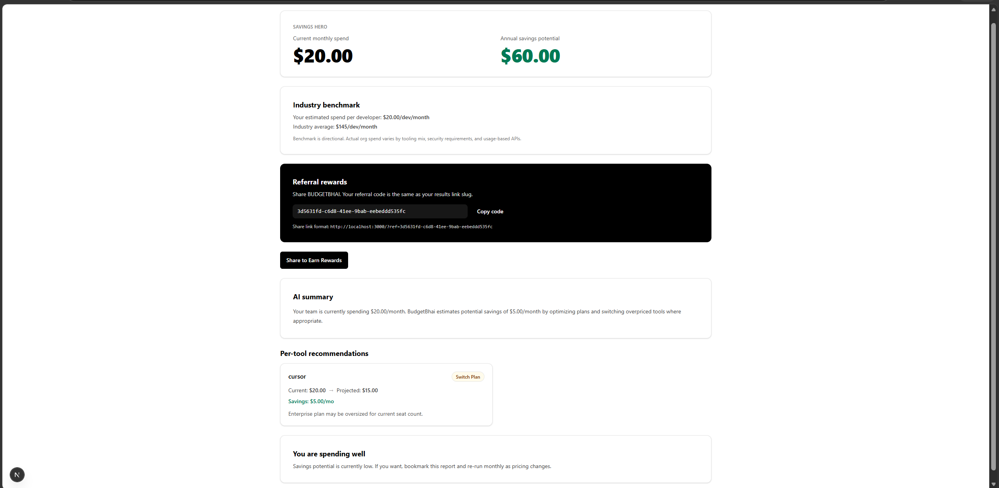
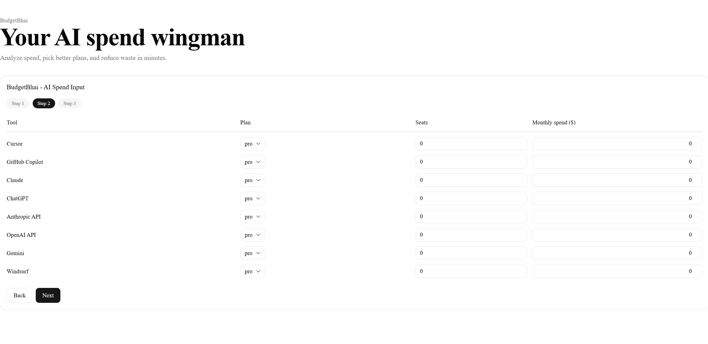

# AI Spend Audit — BUDGETBHAI

> **Find out where your team is overpaying for AI tools — in 3 minutes, for free.**

A free web app for startup founders and engineering managers that audits their AI tool
stack (Cursor, Copilot, Claude, ChatGPT, Gemini, and more), identifies overspend, and
surfaces specific downgrade or switch recommendations with real savings numbers.
Built as a lead-generation asset for [Credex], which sells
discounted AI infrastructure credits.

**Live URL:** https://ai-spend-calculator.vercel.app/

---

## Screenshots

> 📸 Replace the placeholders below with real screenshots before submitting.
> Minimum 3. Loom or YouTube link also accepted (30-second walkthrough).

| Spend Input Form | Audit Results | Credex CTA (high savings) |
|---|---|---|
|  |  |  |

**Screen recording (30s walkthrough):** [YouTube / Loom link — add before submitting]

---

## What It Does
    
1. User inputs their AI tools, plans, seat count, team size, and primary use case
2. A rule-based audit engine evaluates every tool against verified current pricing
3. Results page shows per-tool breakdown: current spend → recommended action → savings
4. An Anthropic API call generates a ~100-word personalised summary (template fallback
   if the API fails)
5. High-savings users (>$500/mo) see a Credex consultation CTA
6. Every audit gets a unique shareable URL with Open Graph previews
7. Optional email capture stores leads in Supabase and triggers a Resend confirmation

---

## Quick Start

### Prerequisites
- Node.js 20+
- A Supabase project (free tier works)
- Anthropic API key
- Resend API key

### Install and run locally

```bash
# Clone the repo
git clone https://github.com/sourabh-roj/ai-spend-calculator.git
cd ai-spend-calculator

# Install dependencies
npm install

# Copy env template and fill in your keys
cp .env.example .env.local
```

Edit `.env.local`:
```env
ANTHROPIC_API_KEY=sk-ant-api03-...
NEXT_PUBLIC_APP_URL=http://localhost:3000
SUPABASE_URL=https://xxxx.supabase.co
SUPABASE_SERVICE_ROLE_KEY=eyJ...
RESEND_API_KEY=re_...
```

```bash
# Run the dev server
npm run dev

# Open in browser
open http://localhost:3000
```

### Run the database schema

In your Supabase project → SQL Editor, run the contents of `schema.sql` at the repo
root. This creates the `audits` and `leads` tables with correct indexes.

### Run tests

```bash
npm test
```

Tests cover the audit engine specifically — plan-fit logic, savings calculations,
Credex upsell threshold, and edge cases. See `TESTS.md` for the full list.

### Lint and type check

```bash
npm run lint
npx tsc --noEmit
```

---

## Deploy to Vercel

```bash
# Install Vercel CLI
npm install -g vercel

# Deploy
vercel --prod
```

Or connect the GitHub repo at **vercel.com/new** for automatic deploys on every push
to `main`. Set the five environment variables from `.env.example` in the Vercel
dashboard before deploying.

Lighthouse scores on the deployed URL:
- Performance: [add score]
- Accessibility: [add score — must be ≥90]
- Best Practices: [add score — must be ≥90]

---

## Project Structure

```
ai-spend-calculator/
├── app/
│   ├── page.tsx                  # Landing page + spend input form
│   ├── results/
│   │   └── [slug]/
│   │       ├── page.tsx          # Server component — fetches audit, generates OG tags
│   │       └── ResultsClient.tsx # Client component — AI summary, lead capture, share
│   └── api/
│       ├── audit/route.ts        # POST — runs audit engine, saves to Supabase
│       ├── summary/route.ts      # POST — calls Anthropic API, returns summary
│       ├── leads/route.ts        # POST — saves lead, triggers Resend email
│       └── og/route.tsx          # GET — generates dynamic OG image (Edge runtime)
├── lib/
│   ├── audit-engine/
│   │   └── index.ts              # Pure function — input → audit result, no I/O
│   ├── pricing-data.ts           # Verified pricing constants (see PRICING_DATA.md)
│   ├── supabase/
│   │   └── server.ts             # Supabase server client
│   └── types.ts                  # Shared TypeScript interfaces
├── __tests__/
│   └── audit-engine.test.ts      # 5+ Jest tests covering audit logic
├── .github/
│   └── workflows/
│       └── ci.yml                # Lint + test on every push to main
├── schema.sql                    # Supabase table definitions
├── ARCHITECTURE.md
├── DEVLOG.md
├── ECONOMICS.md
├── GTM.md
├── LANDING_COPY.md
├── METRICS.md
├── PRICING_DATA.md
├── PROMPTS.md
├── REFLECTION.md
├── TESTS.md
└── USER_INTERVIEWS.md
```

---

## Decisions

Five meaningful trade-offs made during the build:

### 1. Hardcoded audit rules instead of AI-generated recommendations

**Decision:** The audit engine (`lib/audit-engine/index.ts`) is a pure TypeScript
function with hardcoded rules. It does not call any LLM.

**Why:** AI-generated audit logic risks hallucinating savings numbers. If the tool
tells a user they can save $400/month by switching plans and that number is wrong,
they lose trust immediately and the Credex lead is poisoned. Hardcoded rules are
auditable, deterministic, fully testable, and free to run. The LLM is used only
for the narrative summary paragraph — where tone matters and a template fallback
is acceptable. Knowing when *not* to use AI is a deliberate engineering choice.

### 2. Next.js App Router over Vite + React

**Decision:** Next.js 14 App Router with server components for the results page.

**Why:** The results page needs server-side rendering specifically for Open Graph
tags — social crawlers (Twitter, LinkedIn, Slack) do not execute JavaScript, so
a pure SPA would show blank previews. The shareable URL with a rich OG image is
the viral loop feature. SSR is not optional. Next.js gives SSR, route handlers,
and Edge runtime in one framework with zero-config Vercel deployment. A separate
Express server for SSR would add infrastructure complexity with no benefit at
this scale.

### 3. Supabase over Firebase

**Decision:** Supabase (Postgres) instead of Firebase (Firestore).

**Why:** The data is relational — leads reference audits, and the Credex sales
dashboard needs to filter leads by savings amount and join to audit tool data.
In Firestore this requires multiple reads and manual joining in application code.
In Postgres it is one query. I started with Firebase on Day 2 and reversed the
decision on Day 3 after writing the first cross-table query. The migration cost
was half a day but the correct data model is worth it.

### 4. Email captured after value shown, never before

**Decision:** The full audit result — savings numbers, per-tool breakdown, AI
summary — is shown before any email is requested.

**Why:** This is explicitly stated in the brief and it is also the correct product
decision. An email gate before results trains users to distrust the tool and
dramatically lowers completion rates. Showing the number first means the user
has already received value when the email ask appears — conversion is higher and
the lead quality is better because the user has seen real savings.

### 5. Honeypot over hCaptcha for abuse protection

**Decision:** A hidden honeypot field on the lead capture form instead of hCaptcha
or reCAPTCHA.

**Why:** hCaptcha and reCAPTCHA add visible friction (a puzzle or checkbox) and
require an external script load that hurts Lighthouse Performance scores. A
honeypot field is invisible to real users — if it is filled, the submission is
silently discarded. For a tool at this traffic level, where leads are manually
reviewed by a human at Credex anyway, a honeypot catches the vast majority of
bot submissions without any UX cost. Rate limiting (3 submissions per IP per hour
via Upstash) handles the remainder.

---

## Tech Stack

| Layer | Choice |
|---|---|
| Framework | Next.js 14 (App Router) |
| Language | TypeScript |
| Styling | Tailwind CSS + shadcn/ui |
| Database | Supabase (Postgres) |
| AI | Anthropic API (claude-sonnet-4-20250514) |
| Email | Resend |
| Hosting | Vercel |
| CI | GitHub Actions |
| Testing | Jest |

---

## Environment Variables

| Variable | Required | Description |
|---|---|---|
| `ANTHROPIC_API_KEY` | Yes | Anthropic API key for audit summaries |
| `NEXT_PUBLIC_APP_URL` | Yes | Full URL of deployed app (no trailing slash) |
| `SUPABASE_URL` | Yes | Supabase project URL |
| `SUPABASE_SERVICE_ROLE_KEY` | Yes | Supabase service role key (server-side only) |
| `RESEND_API_KEY` | Yes | Resend API key for transactional emails |

No secrets are committed to the repository. All keys are loaded via environment
variables. See `.env.example` for the full template.

---

## Acknowledgements

Built for the Credex Web Development Intern Assignment — Round 1.
Pricing data verified against official vendor pages during submission week (May 2026).
See `PRICING_DATA.md` for sources.